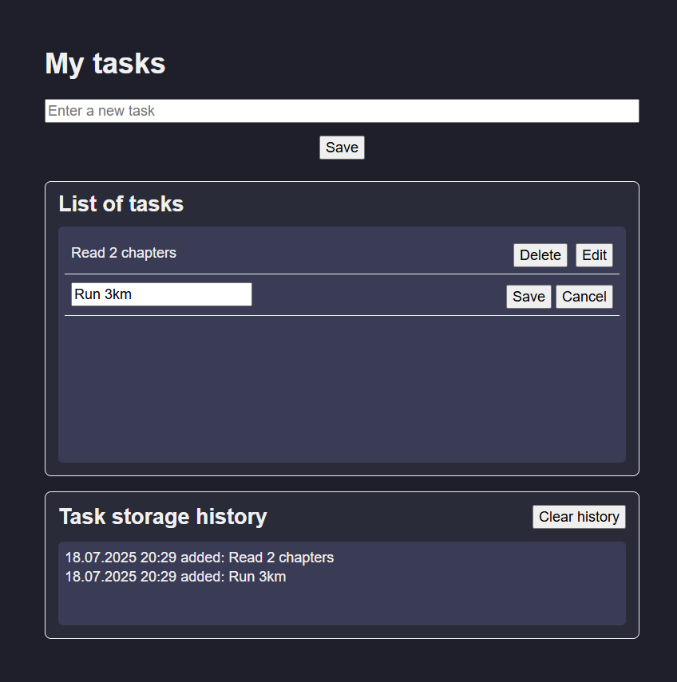

# 📝 My Tasks App

> Простий таск-менеджер у браузері з історією змін та локальним збереженням даних.



## 🔍 Опис

Цей застосунок дозволяє створювати, редагувати та видаляти завдання зі списку. Всі дії зберігаються у `localStorage`, що дає змогу зберігати список навіть після перезавантаження сторінки. Також ведеться **історія** змін: коли завдання було додано, змінено або видалено.

---

## ⚙️ Функціональність

- ✅ Додавання нових завдань
- ✏️ Редагування існуючих завдань
- ❌ Видалення завдань
- 🕓 Історія змін із часовою міткою
- 💾 Збереження усіх даних у `localStorage`
- 🧹 Очищення історії одним кліком
- 🎨 Темна тема інтерфейсу (CSS змінні)

---

## 🛠️ Технології

- HTML5
- CSS3 (змінні, флекси, адаптивна верстка)
- JavaScript (ES6)
- LocalStorage API

---

## 🚀 Як запустити

1. Скопіюйте репозиторій або збережіть файли:
    - `index.html`
    - `style.css`
    - `reset.css` *(за потреби)*
    - `script.js`

2. Відкрийте `index.html` у браузері.

> Усі дані зберігаються локально у вашому браузері — немає потреби у сервері або бекенді.

---

## 📁 Структура

```
📦 my-tasks-app
├── index.html
├── style.css
├── reset.css
└── script.js
```

---

## 🧪 Приклад використання

1. Введіть завдання у поле "Enter a new task".
2. Натисніть **Save** — завдання додасться до списку.
3. Натисніть на завдання — з’являться кнопки **Edit** та **Delete**.
4. Відредагуйте або видаліть завдання.
5. Перегляньте історію дій у нижній частині екрана.
6. Очистіть історію за допомогою кнопки **Clear history**.

---

## 💡 Поради

- Якщо при редагуванні або видаленні виникли проблеми — спробуйте оновити сторінку. Дані не зникнуть.
- У мобільній версії поле вводу автоматично адаптується до ширини екрана.
- Ви можете стилізувати застосунок за допомогою CSS-змінних у `:root`.

---


## 📜 Ліцензія

Цей проєкт можна використовувати для навчання та власних потреб. Для комерційного використання — змініть назву та додайте власну стилізацію.

---

## ✍️ Автор

**[Юлія Першина]**

